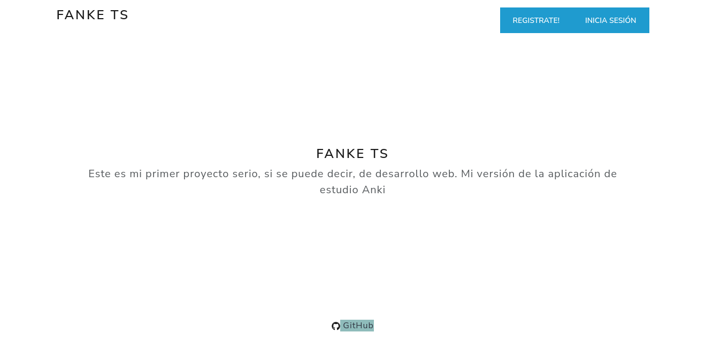
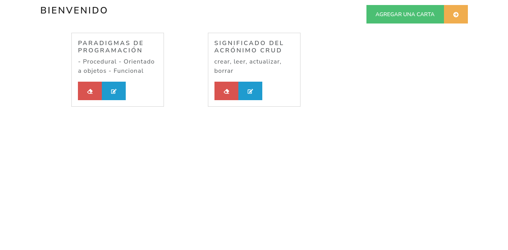

## Fanke TS

Versión simple de la aplicación de estudio Anki.

Se uso MERN-Typescript Stack

## Imagenes del proyecto

- ***Pagina de inicio*** 
  

- ***Pagina del usuario***

## To Do
- Agregar contexto para persistencia de sesión en React, alternativa es usar cookies
- Agregar función de **estudio**
- Agregar posibilidad de añadir multimedia a la tarjetas
- Mejorar estilos de las tarjetas
- Documentar y estilizar código